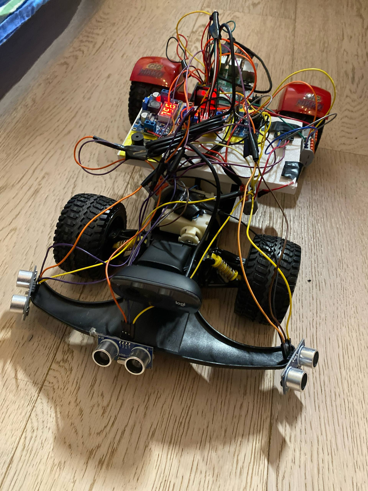
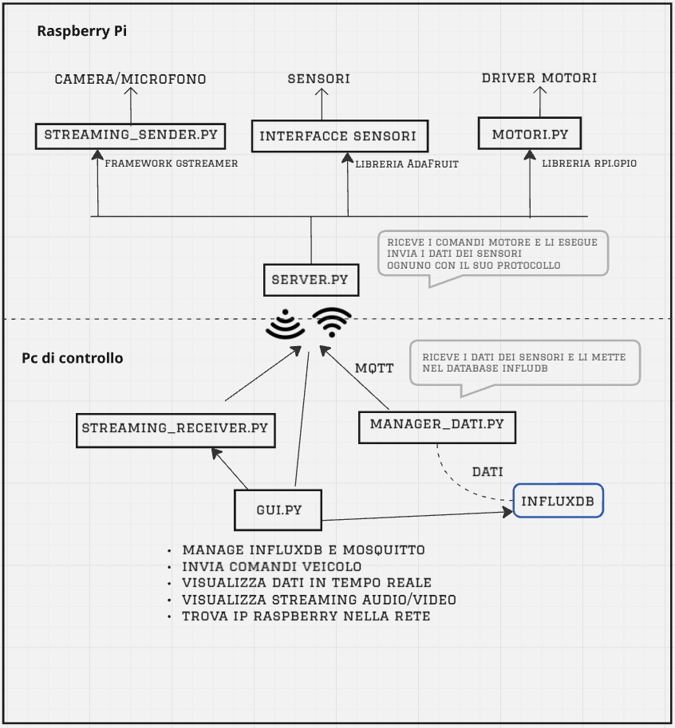
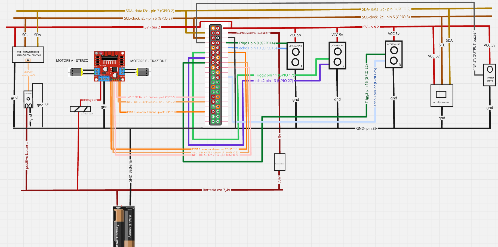
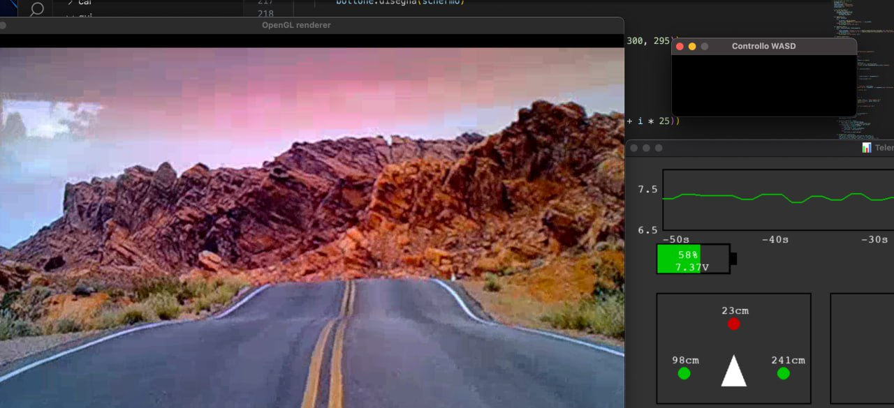

# Sviluppo di un veicolo terrestre a controllo remoto

## Tesi triennale in informatica - Marco Catanzaro

Questo progetto costituisce la mia tesi di laurea triennale in Informatica presso l'Università degli Studi di Udine, realizzata a seguito di un tirocinio svolto nel "Laboratorio di droni e sistemi autonomi". L'obiettivo principale è sviluppare un veicolo terrestre a controllo remoto, impiegando tecnologie avanzate per il controllo e la gestione dei dati.

## Il veicolo completo

### Struttura del progetto

Il progetto nasce dal recupero di una macchina radiocomandata degli anni '80, alla quale sono state rimosse le componenti originali per essere sostituite con tecnologie moderne. Il cuore del sistema è un **Raspberry Pi 3+**, affiancato da driver motori come **L298N** e una vasta gamma di sensori e attuatori: sensori a ultrasuoni per la rilevazione degli ostacoli, accelerometri per il monitoraggio del movimento, buzzer per segnalazioni acustiche, sensori di tensione per il controllo dell'alimentazione, oltre a videocamere e microfoni per la raccolta di dati visivi e sonori. Questa trasformazione consente di integrare funzionalità avanzate e di sperimentare soluzioni innovative nel campo dei veicoli autonomi.

## Diagramma del sistema

### Obiettivi futuri

Attualmente, tutti i dati passati tramite **MQTT** e raccolti dai sensori vengono memorizzati in un **database InfluxDB** timestamp based e utilizzati in tempo reale per la generazione di grafici e strumenti visivi di supporto alle decisioni durante il pilotaggio remoto.

Questo è reso possibile anche grazie a una progettazione **modulare**, sia lato software che lato client.

Un ulteriore obiettivo, più immediato, potrebbe essere l'integrazione di un sistema di **cifratura simmetrica** (ad esempio tramite **AES**) nella comunicazione tramite socket UDP per l'invio dei comandi ai motori. Questo permetterebbe di aumentare la sicurezza delle trasmissioni, evitando che utenti non autorizzati possano prendere il controllo del veicolo inviando pacchetti al server del Raspberry Pi.

## Circuito elettronico

### Codice del progetto

Il codice si articola in due componenti principali:

1. **Software a bordo del Raspberry Pi**  
    Implementa un server multithread che gestisce simultaneamente i sensori, lo streaming audio/video e il controllo dei motori del veicolo.

2. **Software sul PC di controllo**  
    Include la logica per l'invio dei comandi, il broker MQTT (**Mosquitto**) e il database (**InfluxDB**). È presente anche un'**interfaccia grafica** che semplifica la gestione e l'avvio dei vari servizi.

## Interfaccia grafica

### Obiettivi Tecnici raggiunti

- Migliorare il codice di controllo, in modo che il **veicolo sia fluido e reattivo**
- Usare il protocollo **wifi dual band 2.4** e 5 ghz ha ridotto delay e aumentato throughput
- Fare un sistema ON/OFF veloce da far partire, grazie alle **interfacce modulari**
- Ottimizzare la **gestione energetica** del veicolo (2 pile LI-ION 18650 da 3V l'una)
- Integrare **diverse configurazioni di sensori**, per avere una **qualità maggiore dei dati**
- Rendere il sistema facilmente replicabile e documentato per **favorire la condivisione** e la collaborazione

## Test su strada

### Tecnologie utilizzate

- **Python**: Linguaggio principale per lo sviluppo del software.
- **MQTT**: Protocollo leggero e affidabile per la comunicazione IoT
- **Pygame**: Libreria per la creazione di un'interfaccia grafica intuitiva e interattiva.
- **GStreamer**: Framework avanzato per lo streaming audio/video.
- **Socket UDP**: Protocollo per la trasmissione di dati in tempo reale.
- **InfluxDB**: Database per la memorizzazione dei dati dei sensori.
- **Mosquitto**: Broker MQTT per la gestione della comunicazione.
- **RPi.GPIO**: Libreria per il controllo dei pin GPIO del Raspberry Pi.
- **Adafruit CircuitPython**: Libreria per la gestione di sensori avanzati.
- **OpenCV**: Libreria per l'elaborazione di immagini e video.
- **NumPy**: Libreria per il calcolo numerico e la gestione dei dati dei sensori.

Grazie per l'interesse nel mio progetto! Se hai domande o suggerimenti, non esitare a contattarmi.